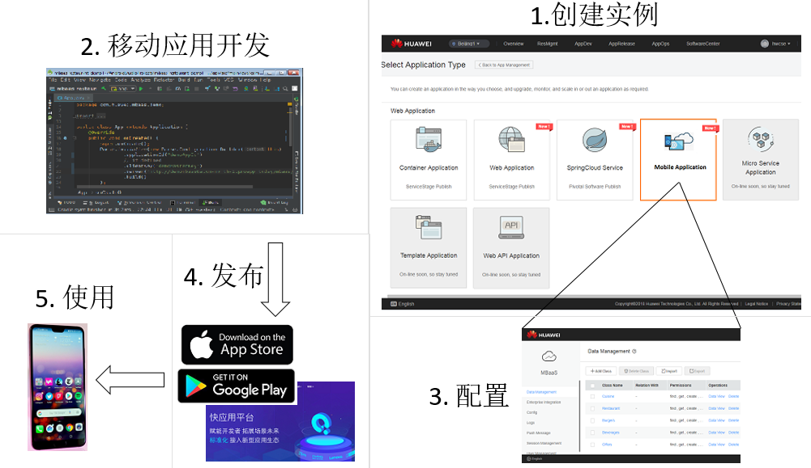

## Overview

Huawei Mobile Backend is a Huawei Public Cloud service.  A user can create this service using [ServiceStage](https://www.huaweicloud.com/en-us/product/servicestage.html) in the Huawei Public Cloud.  Huawei Mobile Backend provides various mobile backend support features such as Data Storage, User Management, Access Control, Session Management and more.  It comes with a browser-based Dashboard and allows developers to easily configure and manage the Mobile Backend.  

The following diagrams show the usage of Huawei Mobile Backend.  Start by creating a new service from ServiceStage, develop your mobile application and configure mobile backend, then publish the mobile application to different platforms and use it on your mobile phone.  

