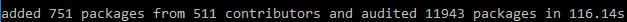
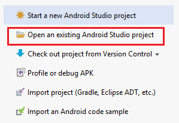
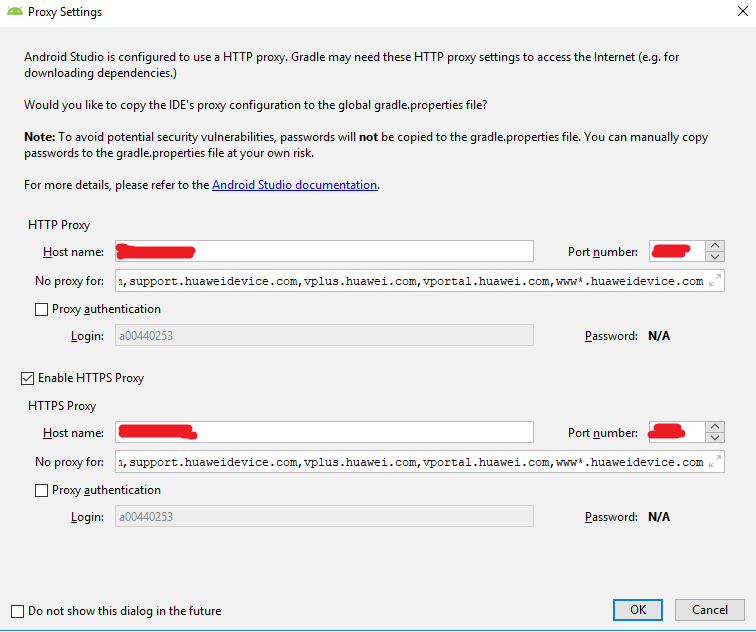
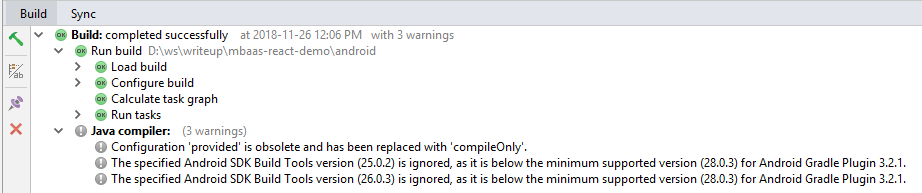

### Step 3:  Load React Native Sample from Github

1.	Run ‘git clone https://github.com/CPE-OAuth/servicestage-mobileapp-react-example.git’  

2.	Change to **<path to>/servicestage-mobileapp-react-example**.  

3.	Run ‘npm install’ to install project dependency.  It may take some time to install all dependency.  Once completed, it shows a line similar to the below.  
  

4.	Run ‘npm install -g react-native-cli’ to install react native client.  

5.	Start Android Studio.  

6.	Click **Open an existing Android Studio Project**.  
  

7.	Select **<path to>/servicestage-mobileapp-react-example/android**.  Click OK.  

8.	A dialog may show up asking for proxy information.  Update the proxy information if needed to continue.  
  

9.	(Optional) If you get connection issues in the next step, you may need to update the gradle properties file. For example, 
edit C:\Users\<user_name>\.gradle\gradle.properties to include the following:  
  

```
   systemProp.https.proxyHost=proxy.company.com
   systemProp.https.proxyPort=8080
   systemProp.https.proxyUser=userid
   systemProp.https.proxyPassword=password
   systemProp.http.proxyHost=proxy.company.com
   systemProp.http.proxyPort=8080
   systemProp.http.proxyUser=userid
   systemProp.http.proxyPassword=password
```
  
10.	Once complied, it should show the following. (If build failed, Select Gradle Script in the navigation pan, then Build -> Clean Project).  
  

  
  
