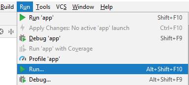
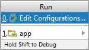
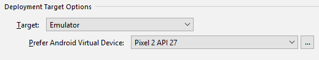
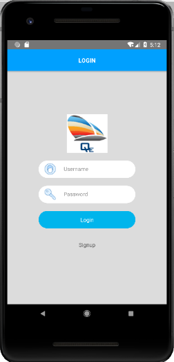

## Step 8:  Run Mobile App in emulator

At this point, setup of the Mobile Application sample, Android Studio and Emulator should be completed.  Follow the instructions below to run the Mobile Application the Emulator.  

1.	**Important**:  If you are developing behind a proxy, proxy may return “Accept Risk page” when the emulator connects to the Mobile Backend.  Before continuing, follow Step 4 to open Mobile Backend Dashboard in your browser and “Accept Risk”.  Keep the Mobile Backend Dashboard alive in the web browser to prevent the proxy from viewing the “Accept Risk” page again.  

2.	Open a command prompt, change to **{{path to}}/servicestage-mobileapp-react-example**.  

3.	Run the following command to bundle the react native code.  Note:  This is for running the sample from Android Studio.  Modified code needs to be repackaged again to be effective.  (note: there are other alternatives to run react native code on emulator).  

```
   react-native bundle --platform android --dev false --entry-file index.android.js --bundle-output android/app/src/main/assets/index.android.bundle --assets-dest android/app/src/main/res
```

4.	Once the above command returns, launch the Android Studio.  

5.	From the menu, click **Run -> Run…**  
  

6.	Select Edit Configurations…  
  

7.	Under Deployment Target Options, select the created emulator.  
  

8.	Click **Run** to start the Mobile Application with emulator.  
  

9.	Click **Signup** to create new account and follow the instruction to login.
