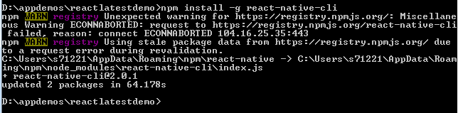
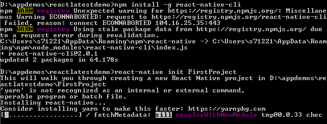
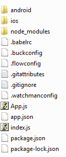
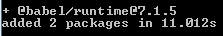

## Step 9:  (Optional) Start your own Mobile App Project  

This step provides instructions for developer who want to know more about creating a Mobile Application from scratch.  

To create a react native project requires Node JS, Android Studio and React Native CLI.  Node JS and Android studio installation are explained in Step 2.  React Native CLI installation is described in Step 3, and will be included in this step.  Running React Native Android app requires Android device, such as a physical android device or an Android Virtual Device (emulater).  Detailed steps to setup emulator is described in Step 8 and Step 9.  

Below are the instructions to create the mobile application using React Native,  

a)  Use npm to install React Native CLI.  Run the following command in a Command Prompt,  

```
   npm install -g react-native-cli
```


b)  Use the React Native CLI to generate a new React Native project.  Run the following command,  
  
```
   react-native init FirstProject
```
  

c)  After creation success, you can find the new project structure as below.  
  

d)	Review <rootdir>/App.js file.  It contains generated react native sample code that renders react native sample message when launched.  

e)	Babel is a JavaScript compiler.  Run the below command to install Babel modular runtime helpers.  

```
   npm add @babel/runtime
```
  

This is all you needed to start a new React Native Mobile App project.  See https://facebook.github.io/react-native/ to add more react native components to your app.  


